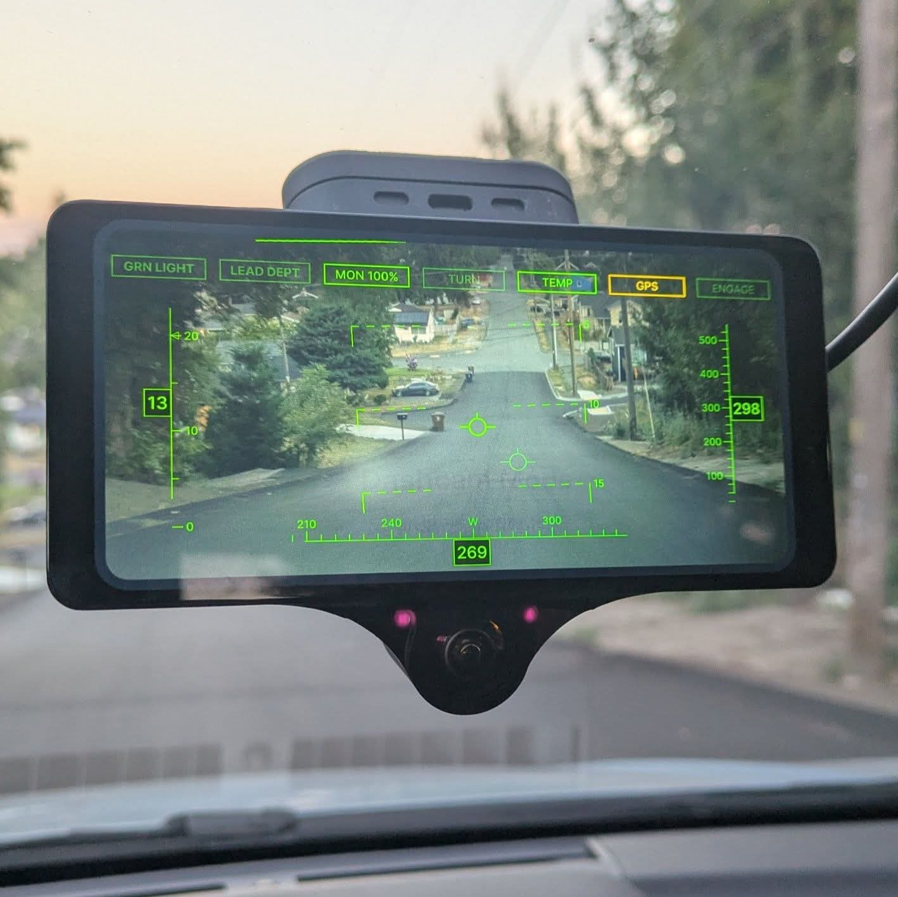

<h1>chameleonpilot</h1>

  <b>An openpilot fork that changes its skin.</b>
   
  Selectable HUD theme packs with automatic night switching, plus selected sunnypilot features.

  <a href="INSTALL.md"><b>Install</b></a>
   · 
  <a href="#roadmap">Roadmap</a>
   · 
  <a href="#how-this-differs-from-upstream">Deviations</a>
   · 
  <a href="#support-and-expectations">Support</a>

<i>
  The aircraft HUD on a comma 3X. Annunciator row across the top, speed (left) and GPS altitude
  (right) tapes, GPS heading along the bottom, pitch ladder and flight path vector over the road.
  The stock speed cluster, lane lines and driving path are hidden here — all of that is optional.
</i>

## What this is

A personal fork of [commaai/openpilot](https://github.com/commaai/openpilot). The headline feature is
**selectable HUD theme packs** — and automatic day/night switching, which is the thing that makes them
worth having.

**Not affiliated with comma.ai or sunnypilot.** This is one person's fork, developed against a single
car. Treat it accordingly.

### In this branch

- **HUD theme packs** — `Stock` (bit-for-bit upstream colours, the regression baseline), `Cascade`
  (glacier teal), `Rainier` (alpine dawn), `Baker` (evergreen), and `Hood` (high-desert dusk).
  Every coloured element onroad is themed: engaged border, path gradient, lane lines, lead markers,
  driver-monitoring arc, alert backgrounds. Offroad chrome (sidebar, settings) too. Safety cues are
  identical in every theme, by test.
- **Night mode** — per-theme night palettes, with manual on/off or automatic. The automatic trigger
  combines ambient light (two thresholds plus a dwell timer, so it doesn't strobe at dusk or flicker
  under streetlights) with a **solar schedule**: when the sun is below civil twilight for your last
  known position, night wins — a bright streetlight at 2 a.m. can no longer flip the day palette on.
- **Night vision video** — optional black & white road camera while the night palette is active,
  like an aircraft's night display.
- **Annunciator row** — seven equal-width legends across the top: green light, lead departing, the
  driver-monitoring readout, turn signal, device temperature, GPS fix quality and engagement state.
  Unlit legends stay visible so you learn where to look, the way a real annunciator panel works.
  The driver-monitoring readout shows your attention score and turns amber while you look away or
  when the camera loses your face — state openpilot tracks but stock never displays.
- **Ported from sunnypilot** — blind spot indicators, turn signal display, rainbow path, real-time
  acceleration bar, green light + lead departure alerts, and auto lane change by blinker.
- **Aircraft tapes** — moving speed, GPS-altitude and GPS-heading scales with boxed readouts, like a
  head-up display's. The speed tape carries two bugs: a filled caret at your cruise set speed and a
  hollow one at the posted speed limit, each pinning to the tape end when it is off-scale. The
  heading hides below walking pace (GPS course, not a compass); altitude appears after the first fix.
  Pairs with hiding the stock speed cluster.
- **Target designator** — aircraft-style corner brackets on the lead car with range and closing rate,
  in place of the stock chevron. Unlike the chevron it draws on stock-ACC cars too, since it is
  information rather than a control cue.
- **Offline map data** — pfeiferj's OSM mapd, downloaded at first run and verified against the pinned
  GitHub release digest before it can ever execute. Feeds a **speed limit sign** (US MUTCD or Vienna
  style, with the upcoming limit) and a **road name display**. Display only — nothing controls speed.
  Pick a US state to download in the Chameleon settings panel.
- **Neural Network Lateral Control (NNLC)** — sunnypilot's neural steering feedforward
  (twilsonco's models), rebuilt against upstream's current torque controller. Default off. Only
  arms on cars with a trained model; on platforms that ship a PID tune (like the 2022 Crosstrek)
  it moves the car onto upstream's own torque tune for that platform when enabled. With the toggle
  off, steering is bit-for-bit stock — pinned by test.
- **Safety cues are pinned to upstream by test.** Road edge red, lead chevron, prompt/critical alert
  backgrounds and sidebar status colours are identical in every theme, day and night. A theme cannot
  recolour a warning.

- **Aircraft HUD elements** — a flight path vector (a winged circle marking where the car is actually
  travelling, with a dimmer ghost riding openpilot's planned path when the two disagree) and a pitch
  ladder. Both default off; the ladder stays hidden until the device is calibrated. The pitch
  ladder's **roll direction is still unconfirmed by eye** — treat that one element as experimental
  even by this fork's standards.

### On other branches

- `master` — tracks upstream `commaai/openpilot` unmodified. Never developed on, so a rebase always
  has a clean base.
- `themes/aircraft` — where the aircraft HUD is developed; merged into `main`.
- `integration-full` — the branch the development device actually boots. Same content as `main`
  without the licence and README commits.
- `port/nnlc` — the NNLC port in isolation, kept for reference now that it is merged.

## Roadmap

Everything originally planned is built and driven except the items below. Priorities are mine and
this is a hobby project, so treat the order as intent rather than a schedule.

| | Item | State |
|---|---|---|
| — | **Speed limit control** | **Not started, biggest remaining feature.** Using map speed limits to actually set cruise: a resolver, offsets and policies. The offline map data it depends on already works, so this is the natural next build. Today the fork only *displays* limits. |
| — | **"Create your own theme" docs** | Intended. The palette schema is a frozen dataclass and themes register in one tuple, so a theme is one file — it just needs writing up. |
| — | Pitch ladder roll direction | Needs one deliberate look on a banked road. |
| — | Night drive verification | The solar night trigger and the black & white video have not been watched through a full dusk. |
| — | Dynamic Experimental Control | Undecided whether it belongs here at all. |
| — | Subaru stop-and-go / start-stop defeat | Blocked on CAN work unrelated to this fork's UI focus. |

Deliberately **not** planned: MADS, Smart Cruise Control, custom driving-model selection, and
always-on driver monitoring. Those are the reasons sunnypilot exists; this fork is not trying to
replace it.

## How this differs from upstream

The design constraint that shapes every decision here: **keep the upstream diff small enough to rebase
on comma's `master` indefinitely.** Almost all of this fork lives in its own directories
(`openpilot/selfdrive/ui/chameleon/`, `openpilot/selfdrive/ui/themes/`, `openpilot/chameleon/`) and
touches upstream files in roughly a hundred lines total, mostly one-line hooks and import aliases.

Concretely, upstream behaviour changes only in these places, and only when you turn something on:

- **Steering** — NNLC replaces the lateral feedforward when enabled, and moves platforms that ship a
  PID tune onto upstream's own torque tune. Off means bit-for-bit stock, pinned by test.
- **Lane changes** — auto lane change can remove the physical nudge confirmation, gated on the car
  reporting blind spot monitoring. See the warning below.
- **Hidden stock elements** — lane lines, road edges, the driving path, the speed cluster, the wheel
  button and the driver-monitoring face can each be hidden. Hiding road edges hides a warning cue.
- **A new native process** — pfeiferj's `mapd` runs as a daemon when you download map data. It is
  verified against a pinned SHA-256 before it can ever execute, and it is display-only: it cannot
  influence control.
- **One cereal message** — `liveMapData`, carried in a slot upstream reserves for forks.

Nothing in the safety model changes. The code enforcing it lives in panda, in C, and is untouched.

## Support and expectations

**Issues are disabled and nothing here is monitored.** This is a personal fork published because
publishing costs nothing, not a distribution with a support commitment. If you install it you are
choosing to run software tested on one car by one person.

If that changes I will say so here.

### Auto lane change — read this before enabling it

Upstream openpilot requires a physical steering nudge to commit a lane change. The ported feature can
remove that confirmation step, so it is **gated on the car reporting blind spot monitoring**: without
BSM, a nudge is always required and the setting has no effect. With BSM, nudgeless is available but
never the default. Every toggle in this fork defaults **off**.

## Licensing and attribution

This project uses software from Haibin Wen and SUNNYPILOT LLC and is licensed under a custom license
requiring permission for use.

- **openpilot** code is comma.ai's MIT licence — see [`LICENSE`](LICENSE).
- **Ported sunnypilot** code is sunnypilot's Custom MIT licence — see [`LICENSE.md`](LICENSE.md).
  It requires explicit written permission for commercial, for-profit or closed-source use. Every ported
  file keeps its original copyright header. chameleonpilot is non-commercial and open source.

Original chameleonpilot code (the theme system, night mode and the aircraft HUD elements) is MIT, same
as openpilot.

## Supported hardware and cars

Developed and tested on a **comma 3X** in a **2022 Subaru Crosstrek** (`SUBARU_IMPREZA_2020`), running
AGNOS 18.7. Other cars and devices inherit whatever upstream openpilot supports, but nothing else has
been verified here.

⚠️ **On a comma four you would get almost none of this.** The themes and the aircraft HUD are written
against the `tizi`/`tici` renderers; comma's `mici` device tree has its own and is deliberately
untouched, so a comma four install would look near-stock.

Installation, first-boot expectations and how to go back to stock: **[INSTALL.md](INSTALL.md)**.

---

# Upstream openpilot README

Everything below is comma.ai's, unmodified. The safety, licensing and user-data terms it describes
apply to this fork.

<h1>openpilot</h1>

  <b>openpilot is an operating system for robotics.</b>
   
  Currently, it upgrades the driver assistance system in 300+ supported cars.

<h3>
  <a href="https://docs.comma.ai">Docs</a>
   · 
  <a href="https://docs.comma.ai/contributing/roadmap/">Roadmap</a>
   · 
  <a href="https://github.com/commaai/openpilot/blob/master/docs/CONTRIBUTING.md">Contribute</a>
   · 
  <a href="https://discord.comma.ai">Community</a>
   · 
  <a href="https://comma.ai/shop">Try it on a comma four</a>
</h3>

Quick start: `bash <(curl -fsSL openpilot.comma.ai)`

<table>
  <tr>
    <td></td>
    <td></td>
    <td></td>
  </tr>
</table>

Using openpilot in a car
------

To use openpilot in a car, you need four things:
1. **Supported Device:** a comma four, available at [comma.ai/shop/comma-four](https://www.comma.ai/shop/comma-four).
2. **Software:** The setup procedure for the comma four allows users to enter a URL for custom software. Use the URL `openpilot.comma.ai` to install the release version.
3. **Supported Car:** Ensure that you have one of [the 300+ supported cars](docs/CARS.md).
4. **Car Harness:** You will also need a [car harness](https://comma.ai/shop/car-harness) to connect your comma four to your car.

We have detailed instructions for [how to install the harness and device in a car](https://comma.ai/setup). Note that it's possible to run openpilot on [other hardware](https://blog.comma.ai/self-driving-car-for-free/), although it's not plug-and-play.

### Branches

Running `master` and other branches directly is supported, but it's recommended to run one of the following prebuilt branches:

| comma four branch      | comma 3X branch        | URL                                    | description                                                                         |
|------------------------|------------------------|----------------------------------------|-------------------------------------------------------------------------------------|
| `release-mici`         | `release-tizi`         | openpilot.comma.ai                     | This is openpilot's release branch.                                                 |
| `release-mici-staging` | `release-tizi-staging` | openpilot-test.comma.ai                | This is the staging branch for releases. Use it to get new releases slightly early. |
| `nightly`              | `nightly`              | openpilot-nightly.comma.ai             | This is the bleeding edge development branch. Do not expect this to be stable.      |
| `nightly-dev`          | `nightly-dev`          | installer.comma.ai/commaai/nightly-dev | Same as nightly, but includes experimental development features for some cars.      |

To start developing openpilot
------

openpilot is developed by [comma](https://comma.ai/) and by users like you. We welcome both pull requests and issues on [GitHub](http://github.com/commaai/openpilot).

* Join the [community Discord](https://discord.comma.ai)
* Check out [the contributing docs](docs/CONTRIBUTING.md)
* Check out the [openpilot tools](openpilot/tools/)
* Code documentation lives at https://docs.comma.ai
* Information about running openpilot lives on the [community wiki](https://github.com/commaai/openpilot/wiki)

Want to get paid to work on openpilot? [comma is hiring](https://comma.ai/jobs#open-positions) and offers lots of [bounties](https://comma.ai/bounties) for external contributors.

Safety and Testing
----

* openpilot observes [ISO26262](https://en.wikipedia.org/wiki/ISO_26262) guidelines, see [SAFETY.md](docs/SAFETY.md) for more details.
* openpilot has software-in-the-loop [tests](.github/workflows/tests.yaml) that run on every commit.
* The code enforcing the safety model lives in panda and is written in C, see [code rigor](https://github.com/commaai/panda#code-rigor) for more details.
* panda has software-in-the-loop [safety tests](https://github.com/commaai/panda/tree/master/tests/safety).
* Internally, we have a hardware-in-the-loop Jenkins test suite that builds and unit tests the various processes.
* panda has additional hardware-in-the-loop [tests](https://github.com/commaai/panda/blob/master/Jenkinsfile).
* We run the latest openpilot in a testing closet containing 10 comma devices continuously replaying routes.

MIT Licensed

openpilot is released under the MIT license. Some parts of the software are released under other licenses as specified.

Any user of this software shall indemnify and hold harmless Comma.ai, Inc. and its directors, officers, employees, agents, stockholders, affiliates, subcontractors and customers from and against all allegations, claims, actions, suits, demands, damages, liabilities, obligations, losses, settlements, judgments, costs and expenses (including without limitation attorneys’ fees and costs) which arise out of, relate to or result from any use of this software by user.

**THIS IS ALPHA QUALITY SOFTWARE FOR RESEARCH PURPOSES ONLY. THIS IS NOT A PRODUCT.
YOU ARE RESPONSIBLE FOR COMPLYING WITH LOCAL LAWS AND REGULATIONS.
NO WARRANTY EXPRESSED OR IMPLIED.**

User Data and comma Account

By default, openpilot uploads driving data to our servers. You can also access your data through [comma connect](https://connect.comma.ai/). We use your data to train better models and improve openpilot for everyone.

openpilot is open source software, and users can disable data collection if they wish.

openpilot logs the road-facing cameras, CAN, GPS, IMU, magnetometer, thermal sensors, crashes, and operating system logs.
The driver-facing camera and microphone are only logged if you explicitly opt-in in settings.

By using openpilot, you agree to [our Privacy Policy](https://comma.ai/privacy). You understand that use of this software or its related services will generate certain types of user data, which may be logged and stored at the sole discretion of comma. By accepting this agreement, you grant an irrevocable, perpetual, worldwide right to comma for the use of this data.

